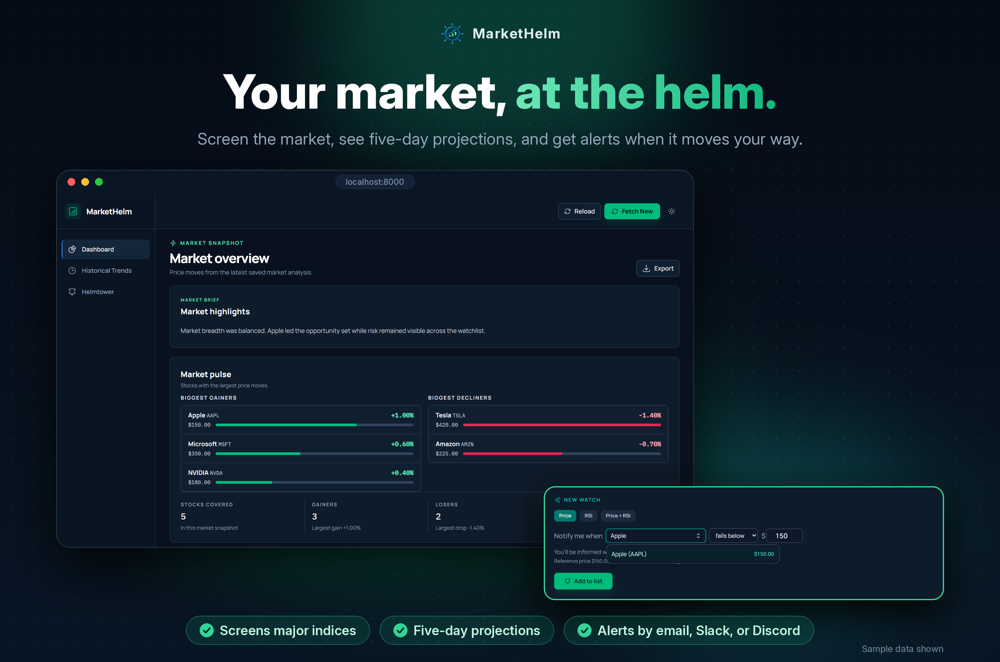

<div align="center">
  
  <h1>MarketHelm</h1>
  <p><strong>Stock-market monitoring, projections, and alerts—from CLI to web dashboard.</strong></p>
  <p>
    <a href="https://github.com/lawaloy/market-helm/actions/workflows/python-app.yml"></a>
    <a href="https://pypi.org/project/market-helm/"></a>
    <a href="https://pypi.org/project/market-helm/"></a>
    <a href="LICENSE"></a>
    <a href="CONTRIBUTING.md"></a>
  </p>
  <p>
    <a href="#quick-start">Quick start</a> ·
    <a href="docs/README.md">Documentation</a> ·
    <a href="docs/PROJECT_STATUS.md">Project status</a> ·
    <a href="CONTRIBUTING.md">Contributing</a>
  </p>
</div>

MarketHelm screens major indices, fetches market data, produces five-session
projections, records results, and can deliver configured alerts. Broker
execution is not implemented; see [Project status](docs/PROJECT_STATUS.md) for
the evidence-based feature matrix and current priorities.

## Product tour

The dashboard turns saved market data into an at-a-glance view of movers,
projection confidence, recommendations, risk, and potential opportunities.
Helmtower lets operators create price, RSI, or combined watches and route
notifications through the configured email, Discord, or Slack channels.

<p align="center">
  <a href="docs/assets/readme/markethelm-hero.png"></a>
</p>

Screenshots use deterministic sample data. Select the image to view it full size.
Maintainers can regenerate the dashboard and alerts captures that make up this image from the seeded local application with
`cd e2e && npm run capture:readme`. The hero itself is composed from those captures by `scripts/compose_readme_hero.py` (see the docstring for the 2x capture command).

## What runs where?

| Mode             | Command or entry point            | What runs                                       | Open in a browser                       |
| ---------------- | --------------------------------- | ----------------------------------------------- | --------------------------------------- |
| Daily tracker    | `market-helm`                     | CLI workflow; stores market data and reports    | Nothing                                 |
| Packaged web app | `market-helm-web`                 | FastAPI API and compiled React UI on one server | <http://localhost:8000>                 |
| Web development  | FastAPI on 8000 plus Vite on 3000 | API and hot-reloading React UI                  | <http://localhost:3000>                 |
| Hosted staging   | `docker-compose.staging.yml`      | PostgreSQL, API/compiled UI, and alert worker   | The hostname configured by the operator |

The production web image does **not** require a separately hosted frontend.
[`Dockerfile.web`](Dockerfile.web) builds React and copies it into the FastAPI
image, which serves both the UI and `/api/*` on port 8000.

The repository currently provides portable deployment artifacts, not a live
public MarketHelm URL or a selected cloud provider. Provider selection, DNS/TLS,
managed PostgreSQL, email delivery, and external monitoring remain operator
sign-off tasks in [Deployment and persistence](docs/DEPLOYMENT.md#external-staging-sign-off).

## Quick start

### Requirements

- Python 3.12 or newer
- A [Finnhub API key](https://finnhub.io/register) for fetching live market data
- Node.js is needed when running from a source checkout because the ignored
  React build output must be created locally. Published packages already include it.

Create and activate a virtual environment.

On Windows PowerShell:

```powershell
py -3 -m venv .venv
.venv\Scripts\Activate.ps1
```

On macOS, Linux, or Cursor Cloud:

```bash
python3 -m venv .venv
source .venv/bin/activate
```

### Fastest local preview: published package

Install from PyPI and start the integrated UI and API:

```bash
pip install market-helm
market-helm-web
```

Open <http://localhost:8000>. API documentation is available at
<http://localhost:8000/docs>.

### Local preview from a source checkout

Install the Python package, install the locked frontend dependencies, and build
the React application once:

```bash
pip install -e .
cd dashboard/frontend
npm ci
npm run build
cd ../..
market-helm-web
```

Open <http://localhost:8000>. For frontend hot reload instead of an integrated
build, use the focused [dashboard development guide](dashboard/README.md).

### Fetch market data

The dashboard can start without an API key or saved data, but its market views
remain empty until data has been fetched. Create `.env` in the directory where
you will run both `market-helm` and `market-helm-web`:

```text
FINNHUB_API_KEY=your-api-key-here
DATA_DIR=./data
```

Run both commands from that same directory. `DATA_DIR` ensures the packaged CLI
and dashboard use the same durable data store:

```bash
market-helm
market-helm-web
```

## Projection validation

Evaluate saved projections against exact NYSE trading sessions:

```bash
market-helm backtest --data-dir data --days 365 --output data/backtest.json
```

Verify the committed projection-evaluator scenario baseline:

```bash
python3 scripts/projection_baseline.py check
```

Assess whether local forward-generated outcomes meet the real-data evidence
gate:

```bash
python3 scripts/projection_baseline.py assess --data-dir data --days 365
```

## Runtime data

| Output                                         | Description                              |
| ---------------------------------------------- | ---------------------------------------- |
| `data/market_bars.sqlite` or configured app DB | Quotes, projections, and daily summaries |
| `data/projections_YYYY-MM-DD.md` (optional)    | Human-readable projection report         |
| `logs/market_helm_YYYY-MM-DD.log`              | Execution logs                           |

Runtime data and credentials are not deployed from Git. Set `DATA_DIR` to an
absolute persistent path when hosting the application.

## Documentation

Use the [documentation index](docs/README.md) to find the single authoritative
guide for each topic:

| Topic                                      | Guide                                      |
| ------------------------------------------ | ------------------------------------------ |
| Commands and output files                  | [Usage](docs/USAGE.md)                     |
| Settings and providers                     | [Configuration](docs/CONFIGURATION.md)     |
| Hosting, persistence, workers, and secrets | [Deployment](docs/DEPLOYMENT.md)           |
| Components and operating modes             | [Architecture](docs/ARCHITECTURE.md)       |
| Current capabilities and roadmap           | [Project status](docs/PROJECT_STATUS.md)   |
| Common failures                            | [Troubleshooting](docs/TROUBLESHOOTING.md) |
| Development and pull requests              | [Contributing](CONTRIBUTING.md)            |

## License

MarketHelm is available under the [MIT License](LICENSE).
